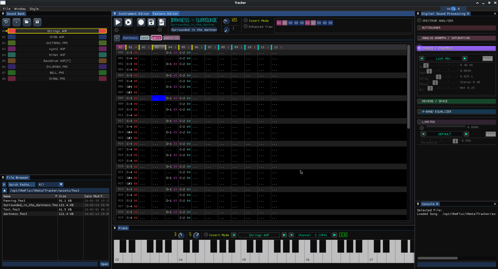

# 🎵 Ohmtal Tracker
## by T.Hühn (XXTH) 2026

Ohmtal Axe is a cross platform OPL3 Tracker. 

--- 

In this Project I use: 

- Framework: [OhmFlux](https://github.com/ohmtal/OhmFlux)
- OPL Controller: [OPL3](https://github.com/ohmtal/OhmFlux/tree/main/engine/opl3)
- FM Soundcore: [YMFM](https://github.com/aaronsgiles/ymfm)
- Backend: [SDL3](https://www.libsdl.org/)
- Gui: [Dear ImGui](https://github.com/ocornut/imgui)
- Development
    - IDE/Text: [KDevelop](https://kdevelop.org/), [Kate](https://apps.kde.org/kate/)
    - Devel/Testing OS: [Arch Linux](https://archlinux.org/), [FreeBSD](https://freebsd.org/)

    
--- 

